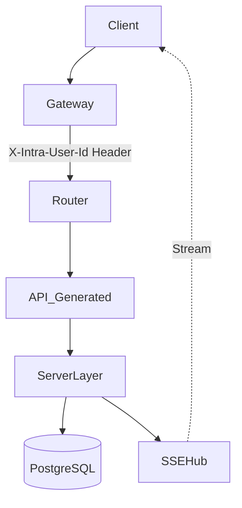

# Realtime Chat Service

Contract-first Go microservice for realtime messaging using OpenAPI-generated handlers, type-safe SQL queries, and Server-Sent Events.

---

## Stack

| Component             | Purpose                                           |
| --------------------- | ------------------------------------------------- |
| Go                    | Backend service runtime                           |
| Chi Router            | Lightweight HTTP routing and middleware           |
| PostgreSQL            | Persistent storage                                |
| sqlc                  | Type-safe query generation from raw SQL           |
| oapi-codegen          | OpenAPI-based server and model generation         |
| SSE                   | Realtime event streaming                          |
| Goroutines + Channels | Concurrent event fanout and connection management |
| Docker                | Local development and deployment                  |

---

## Architecture



---

## Internal Network & Auth

Service sits behind API Gateway. Gateway handles JWT auth. Injects `X-Intra-User-Id` header into requests. Service trusts header. No internal auth middleware needed.

---

## Features

* Realtime message streaming via SSE
* Contract-first API development using OpenAPI
* Type-safe SQL access with sqlc
* Concurrent event broadcasting using Go channels
* Stateless HTTP API
* Direct and group chat support

---

## Design Decisions

### Contract-First API

OpenAPI schemas are treated as the source of truth. `oapi-codegen` generates request/response models and handler interfaces to ensure API consistency.

### sqlc Instead of ORM

Raw SQL is used for explicit query control and compile-time type safety without ORM abstraction overhead.

### SSE Instead of WebSockets

SSE was chosen due to:

* simpler infrastructure requirements
* automatic reconnection support
* lightweight unidirectional streaming
* lower operational complexity for MVP-scale realtime workloads

---

## Domain Logic

### Unified Rooms
Direct messages (`direct`) and group chats (`group`) tracked in unified `rooms` table. Members map via `room_members`.

### Friendships State Machine
Transitions: `requested` → `pending` → `accepted` / `blocked`. Control `is_chat_allowed` limits for `direct` rooms.

### Read Receipts
Store `last_read_message_id` on `room_members` junction. Avoid heavy write ops on message table.

---

## Concurrency Model

Each connected SSE client subscribes to a channel managed by an in-memory event broker.

When a new message is created:

1. Message is persisted to PostgreSQL
2. Event is published into broker channels
3. Connected subscribers receive streamed updates

The broker uses goroutines and channels to:

* fan out events
* manage subscriptions
* prevent blocking writes across active connections

---

## Project Structure

```text
/internal
  /api         # OpenAPI-generated handlers/models
  /database    # sqlc-generated code and DB engine
  /server      # Core domain logic, web routing, SSE Hub

/api
  openapi.yaml
  config.yaml

/sql
  schema.sql
  *_queries.sql
```

---

## Getting Started

### Prerequisites

* Go 1.24+
* Docker
* PostgreSQL

---

## Environment Variables

| Variable           | Description                    |
| ------------------ | ------------------------------ |
| APP_ENV            | Runtime environment (e.g. dev) |
| DB_HOST            | PostgreSQL host                |
| DB_PORT            | PostgreSQL port                |
| DB_USER            | PostgreSQL user                |
| DB_PASSWORD        | PostgreSQL password            |
| DB_DATABASE        | PostgreSQL database name       |
| DB_SCHEMA          | Database schema to use         |
| CHAT_TLS_CERT_FILE | TLS configuration              |
| CHAT_TLS_KEY_FILE  | TLS configuration              |
| CHAT_TLS_CA_FILE   | TLS configuration              |

---

## API Documentation

OpenAPI schema:

```text
/api/openapi.yaml
```

Swagger UI:

```text
http://localhost:8080/swagger
```

---

## Example Requests

### Subscribe to Events

```bash
curl -N http://localhost:8080/events
```

### Send Message

```bash
curl -X POST http://localhost:8080/messages \
  -H "Content-Type: application/json" \
  -d '{
    "content":"hello"
  }'
```

---

## Testing

```bash
go test ./...
```

---

## Limitations

* In-memory broker is not horizontally scalable
* SSE subscriptions are not persisted across restarts
* No distributed pub/sub layer
* No delivery guarantees

---

## Future Improvements (WIP)

* Redis pub/sub integration
* WebSocket fallback support
* Authentication and authorization
* Horizontal scaling support
* Persistent event streaming
